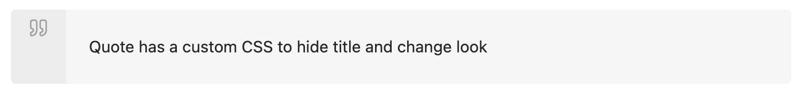
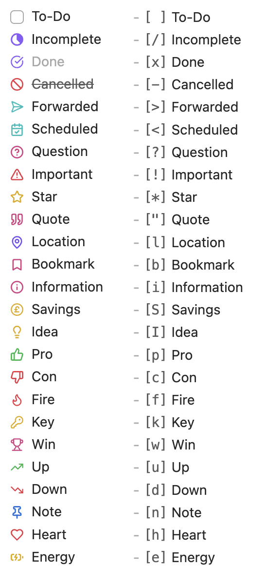
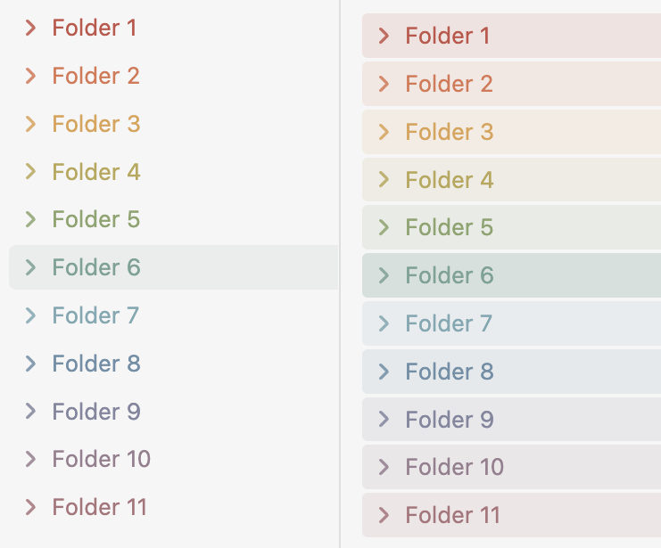

# Obsidian Snippets

A collection of CSS snippets for use in Obsidian.

---
- [Calendar Tweaks](#calendar-tweaks)
- [Box Callout](#callout---box)
- [Quote Callout](#callout---custom-quote)
- [No Icon In Callout](#callout---hidden-icon)
- [Custom Checkboxes](#custom-checkboxes)
- [External Link Icon](#external-link-icon)
- [Icon Switch](#icon-switch)
- [Rainbow Folders](#rainbow-folders)
---

### Calendar Tweaks
- Reduces overall font size
- Strips some container padding
- Fixes calendar container to a max height

---

### Callout - Box
A simple bordered callout. Good for anything you want to seperate from the rest of the page without any distracting titles or colours

### Callout - Custom Quote
A tweak to make the quote callout a bit nicer. Use `cite` to use default style

### Callout - Hidden Icon
If you want a callout without an icon then add `|noicon` to your callout choice.

---

### Custom Checkboxes
A set of custom checkboxes I put together using Lucide icons

---

### External Link Icon
Just in case your theme doesn't give you the option to remove that external link icon

---

### Icon Switch
The reading and live preview icons never made sense to me. I prefer them to show what mode I'm actually using so I switched them round (and the added a new icon for source mode)

---

### Rainbow Folders
My own take on rainbow folders with 'simple' and 'full' options. There are also three colour selections: default rainbow, sherbet and muted. If you want any custom colours then you'll have to add your RGB values to the css snippet under 'user rainbow'. Maybe later I'll update with colour picking via style settings.

